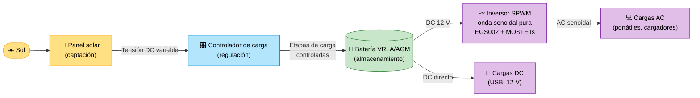

<div align="center">

# ☀️ S.O.S Solar

### Estación solar institucional para carga de dispositivos en emergencias y fallas eléctricas


**Energía limpia, disponible cuando más se necesita.**

[🌞 ¿Qué es?](#-qué-es-sos-solar) · [🔌 Cómo funciona](#-cómo-funciona) · [📚 Glosario](#-glosario-para-curiosos) · [🔬 Resultados técnicos](#-evidencias-y-validación-técnica) · [🛠️ Desafío](#️-el-desafío-que-nos-hizo-mejores-ingenieros) · [👥 Equipo](#-equipo)

</div>

---

> [!NOTE]
> 📸 **Reemplaza este bloque con una foto o GIF del prototipo funcional.**
> Sugerencia: ``

---

## 🌞 ¿Qué es S.O.S Solar?

**S.O.S Solar** es una **estación solar institucional** que permite **cargar dispositivos electrónicos** (celulares, tablets, portátiles, radios) cuando hay **fallas en la red eléctrica o situaciones de emergencia**, usando únicamente energía del sol.

Imagina un punto dentro del colegio donde, aunque se vaya la luz, **siempre haya un lugar seguro para cargar tu celular y comunicarte**. Eso es S.O.S Solar.

### 🎯 El problema que resolvemos

La institución no cuenta con **alternativas energéticas de respaldo** ni con soluciones sostenibles que respondan a cortes de energía o emergencias.

### 💡 Nuestra propuesta

| | |
|---|---|
| 🏫 **Entorno** | Institucional / educativo — Bogotá, Colombia |
| 👥 **¿Para quién?** | Estudiantes, docentes, personal administrativo y de logística |
| ⚡ **¿Qué ofrece?** | Carga de dispositivos con energía renovable y autonomía eléctrica |
| 🌱 **¿Por qué es distinto?** | Energía renovable + autonomía eléctrica completa + diseño adaptado al contexto local |

---

## 🔌 Cómo funciona

El sol entrega energía al panel, que pasa por un **controlador de carga** hacia una **batería**. Un **inversor de onda senoidal pura** transforma esa energía almacenada para alimentar cualquier equipo.



### Las 5 etapas, en palabras sencillas

| # | Etapa | Analogía cotidiana | Función |
|:-:|---|---|---|
| 1 | 🔆 **Captación** | Una cubeta bajo la lluvia | El panel recoge energía solar |
| 2 | 🎛️ **Regulación** | El grifo con llave de paso | El controlador evita que la batería se sobrecargue |
| 3 | 🔋 **Almacenamiento** | Un tanque de agua | La batería guarda energía para cuando no hay sol |
| 4 | 〰️ **Conversión** | Un traductor | El inversor convierte DC en AC limpia y estable |
| 5 | 📱 **Uso** | El vaso de agua | Los usuarios cargan sus dispositivos |

---

## 🏆 Logros y resultados clave

- ✅ **Prototipo funcional construido** y operativo.
- ✅ **Pruebas de carga exitosas** en distintas baterías, ajustando los controladores.
- ✅ **Diseño de esquemático y PCB** del inversor de onda senoidal pura (EGS002 / MOSFETs).
- ✅ **Sistema completo en marcha:** captación, regulación y almacenamiento.

---

## 🔬 Evidencias y validación técnica

No basta con que funcione: **lo medimos y lo verificamos**.

| Qué verificamos | Cómo lo hicimos | Por qué importa |
|---|---|---|
| ⚡ Tensión de entrada | Mediciones Panel → Controlador | Confirma que la captación es adecuada |
| 🔋 Etapas de carga | Control de tensiones hacia la batería | Garantiza la **vida útil** de la batería |
| 〰️ Forma de onda | Verificación con **osciloscopio** | Una onda senoidal pura **no daña** equipos sensibles |
| 📱 Uso real | Pruebas con dispositivos conectados | Valida que sirve en el mundo real |

> [!TIP]
> Agrega aquí capturas del osciloscopio y fotos de las mediciones en `media/images/` y enlázalas desde esta sección.

---

## 🛠️ El desafío que nos hizo mejores ingenieros

<details>
<summary><b>🔎 Haz clic para ver cómo resolvimos la falta de baterías LiFePO₄</b></summary>

<br>

| | |
|---|---|
| ❌ **Problema** | Escasez y falta de stock de baterías **LiFePO₄** en el mercado local |
| ✅ **Solución** | Banco de baterías alternativo **VRLA/AGM**, optimizado con **ingeniería de control** |
| 🔧 **Cómo** | Limitamos la **profundidad de descarga (DoD)** y ajustamos con precisión los **umbrales de carga** |
| 🎓 **Aprendizaje** | Adaptarse a los componentes disponibles sin comprometer la **seguridad** ni la **eficiencia** |

**Mensaje clave:** la ingeniería no es solo diseñar lo ideal, sino lograr lo mejor posible con lo que realmente tienes a la mano.

</details>

---

## 🧭 Elige tu ruta de lectura

Este repositorio está pensado para **dos tipos de lectores**. Despliega la sección que mejor se adapte a ti.

<details>
<summary><b>🌱 Ruta divulgativa: Glosario para curiosos</b></summary>

<br>

### 📚 Glosario para curiosos

| Concepto | ¿Qué significa? | Analogía |
|---|---|---|
| 🔋 **Batería** | Dispositivo que guarda energía eléctrica para usarla después | Un tanque de agua |
| ⚡ **DC (corriente continua)** | La electricidad fluye siempre en un solo sentido. La usan paneles, baterías y celulares | Un río que fluye en una dirección |
| 〰️ **AC (corriente alterna)** | La electricidad cambia de sentido muchas veces por segundo. Es la de los enchufes de la pared | Un vaivén constante, como una sierra |
| 🎛️ **Controlador de carga** | Cuida la batería: decide cuánta energía entra y cuándo parar | Un portero que regula el acceso |
| 🔄 **Inversor** | Convierte la energía DC de la batería en AC para usar equipos de enchufe | Un traductor entre dos idiomas |
| 〰️ **Onda senoidal pura** | AC de la mejor calidad, igual a la de la red eléctrica | Una melodía limpia, sin ruido |
| 🏝️ **Autosuficiencia** | Capacidad de funcionar sin depender de la red eléctrica | Tener tu propia huerta |
| 🌱 **Energía renovable** | Energía de fuentes que no se agotan, como el sol | Una fuente que nunca se seca |

### 🧪 ¿Por qué importa la onda "pura"?

Un inversor económico entrega una onda "cuadrada" o "modificada", que puede **calentar, dañar o hacer fallar** equipos sensibles. Nuestro inversor genera una **onda senoidal pura**, igual a la de la red, que **cuida tus dispositivos**.

</details>

<details>
<summary><b>⚙️ Ruta técnica: Métricas y especificaciones para expertos</b></summary>

<br>

### Resumen técnico

| Parámetro | Valor |
|---|---|
| Topología del inversor | SPWM (modulación por ancho de pulso senoidal), puente de MOSFETs |
| Controlador SPWM | Módulo **EGS002** |
| Forma de onda de salida | Senoidal pura (verificada con osciloscopio) |
| Almacenamiento | Banco **VRLA/AGM** (sustituye a LiFePO₄ por disponibilidad) |
| Protección de batería | Límite de **DoD** y umbrales de carga ajustados |
| Ubicación de diseño | Bogotá, Colombia (≈ 2.600 m s. n. m.) |

> Los valores específicos medidos (potencia del panel, capacidad del banco, rizado, eficiencia, THD) se documentan con sus datos y metodología en **[TECHNICAL_DOCS.md](TECHNICAL_DOCS.md)**.

### Contenido del anexo técnico

- 📐 Esquemáticos y diseño del PCB del inversor
- 〰️ Especificaciones del inversor de onda senoidal pura
- ☀️ Cálculo de autonomía con la radiación solar de Bogotá
- 🔋 Estrategia de gestión de la batería (DoD, umbrales, etapas de carga)
- 📈 Curvas de carga/descarga y análisis de eficiencia

👉 **[Ir al anexo técnico completo](TECHNICAL_DOCS.md)**

</details>

---

## 📊 Comparativa: ¿por qué S.O.S Solar?

| Criterio | Sin respaldo (situación actual) | Planta a combustible | ☀️ **S.O.S Solar** |
|---|:-:|:-:|:-:|
| Funciona en un corte de luz | ❌ | ✅ | ✅ |
| Energía renovable | ➖ | ❌ | ✅ |
| Cero emisiones en operación | ✅ | ❌ | ✅ |
| Operación silenciosa | ✅ | ❌ | ✅ |
| Costo de combustible | ➖ | 💸 Alto | 🆓 Ninguno |
| Valor pedagógico | ❌ | ❌ | ✅ |
| Seguro para equipos sensibles | ➖ | ⚠️ Variable | ✅ Onda senoidal pura |

---

## 🗂️ Estructura del repositorio

```text
S.O.S-Solar/
├── README.md
├── TECHNICAL_DOCS.md
├── docs/
├── schematics/
├── pcb/
├── media/
└── data/
```

> La estructura completa y detallada está en **[ESTRUCTURA_REPOSITORIO.md](ESTRUCTURA_REPOSITORIO.md)**.

---

## 🚀 Qué sigue

- [ ] Instalar la estación en un punto de alta circulación de la institución
- [ ] Señalización y guía de uso para la comunidad educativa
- [ ] Monitoreo de generación y consumo
- [ ] Evaluar el paso a baterías LiFePO₄ cuando haya disponibilidad
- [ ] Talleres de divulgación sobre energía solar para estudiantes

---

## 👥 Equipo

| Integrante | Rol |
|---|---|
| **Juan David Castañeda** | _(agregar rol)_ |
| **Juan Arias** | _(agregar rol)_ |
| **Juan José Torres** | _(agregar rol)_ |

---

## 🙏 Agradecimientos

A la comunidad educativa y a los docentes que acompañaron el desarrollo de este proyecto.

## 📄 Licencia

Distribuido bajo licencia **MIT**. Consulta el archivo `LICENSE` para más información.

<div align="center">

**☀️ Hecho en Bogotá con energía del sol ☀️**

</div>
