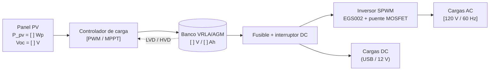
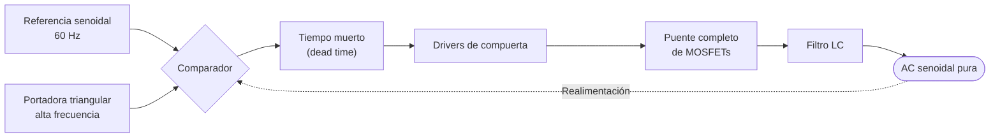
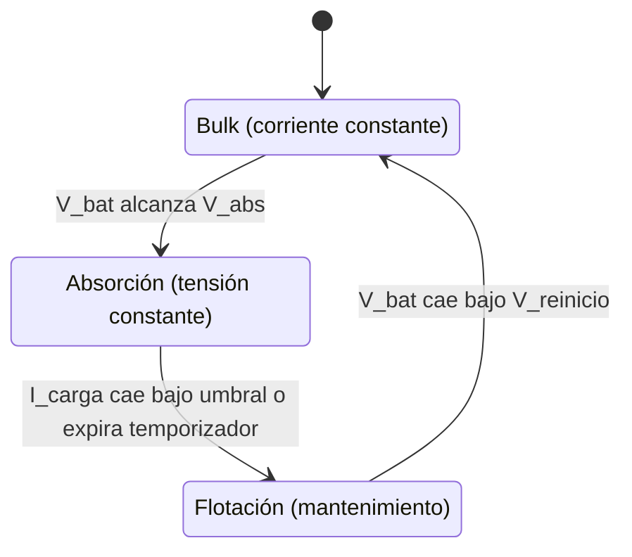

# ⚙️ S.O.S Solar — Anexo Técnico

> Documento dirigido a público especializado (ingeniería, docentes de electrónica y evaluadores técnicos).
> Para la presentación general del proyecto, ver el [README](README.md).

**Convención de este documento**

- Los valores marcados con `[ ... ]` son **datos propios del prototipo** que el equipo debe completar con sus mediciones o con la hoja de datos de sus componentes.
- Los valores marcados como *típicos* son **referencias de la literatura/hojas de datos** y deben verificarse contra los componentes reales usados.
- Los cálculos de ejemplo usan valores **hipotéticos** únicamente para ilustrar el método.

---

## 📑 Tabla de contenido

1. [Arquitectura del sistema](#1-arquitectura-del-sistema)
2. [Esquemáticos y PCB](#2-esquemáticos-y-pcb)
3. [Inversor de onda senoidal pura (SPWM)](#3-inversor-de-onda-senoidal-pura-spwm)
4. [Estrategia de gestión de la batería](#4-estrategia-de-gestión-de-la-batería)
5. [Cálculo de autonomía en Bogotá](#5-cálculo-de-autonomía-en-bogotá)
6. [Plan de mediciones y validación](#6-plan-de-mediciones-y-validación)
7. [Curvas y análisis de eficiencia](#7-curvas-y-análisis-de-eficiencia)
8. [Seguridad](#8-seguridad)
9. [Limitaciones y trabajo futuro](#9-limitaciones-y-trabajo-futuro)

---

## 1. Arquitectura del sistema



### 1.1 Parámetros nominales del sistema

| Subsistema | Parámetro | Valor |
|---|---|---|
| Panel | Potencia pico (Wp) | `[ ]` |
| Panel | Voc / Vmp / Isc / Imp | `[ ]` |
| Controlador | Tipo (PWM / MPPT) y corriente máxima | `[ ]` |
| Batería | Química, tensión nominal, capacidad | VRLA/AGM, `[ ]` V, `[ ]` Ah |
| Inversor | Potencia nominal / pico | `[ ]` W / `[ ]` W |
| Inversor | Tensión y frecuencia de salida | `[120 V / 60 Hz]` (confirmar) |

---

## 2. Esquemáticos y PCB

### 2.1 Archivos de diseño

| Documento | Ruta sugerida | Formato |
|---|---|---|
| Esquemático general del sistema | `schematics/system/sistema_general.pdf` | PDF + fuente |
| Esquemático del inversor SPWM | `schematics/inverter/inversor_spwm.pdf` | PDF + fuente |
| Diseño PCB del inversor | `pcb/inverter/` | Proyecto EDA |
| Archivos de fabricación | `pcb/inverter/gerbers/` | Gerber + Drill |
| Lista de materiales (BOM) | `pcb/inverter/BOM.csv` | CSV |

> `[Indicar la herramienta EDA utilizada (KiCad, EasyEDA, Altium, etc.) y la versión.]`

### 2.2 Bloques del esquemático del inversor

| Bloque | Función |
|---|---|
| Módulo EGS002 | Genera las señales SPWM para el puente y gestiona protecciones/realimentación |
| Drivers de compuerta | Excitan los MOSFET de lado alto y bajo (el módulo EGS002 integra drivers tipo IR2110S; verificar en la hoja de datos) |
| Puente de MOSFETs | Conmutación de potencia en configuración de puente completo |
| Realimentación de tensión | Permite regular la tensión de salida |
| Filtro de salida (LC) | Elimina la componente de conmutación y deja la senoidal |
| Protecciones | Sobrecorriente, sobretemperatura, subtensión de batería |

### 2.3 Criterios de diseño del PCB

- Pistas de potencia dimensionadas para la corriente de batería máxima (ancho de pista y espesor de cobre según IPC-2221).
- Lazo de conmutación del puente lo más corto posible para reducir inductancias parásitas y sobreimpulsos.
- Separación de tierra de potencia y tierra de señal con punto de unión único.
- Condensadores de desacoplo cerca de los drivers y del bus DC.
- Disipación térmica en MOSFETs (área de cobre y/o disipador).

---

## 3. Inversor de onda senoidal pura (SPWM)

### 3.1 Principio de operación

La técnica **SPWM** compara una referencia senoidal (a la frecuencia de salida deseada) con una portadora triangular de alta frecuencia. La salida de esa comparación gobierna el puente de MOSFETs, produciendo pulsos cuyo **ancho promedio sigue una senoide**. Un filtro LC pasa-bajos elimina las componentes de conmutación y entrega una **onda senoidal pura**.



### 3.2 Especificaciones

| Parámetro | Valor | Observación |
|---|---|---|
| Topología | Puente completo SPWM | Modulación bipolar o unipolar según configuración del módulo |
| Controlador | EGS002 | Verificar hoja de datos para frecuencia de portadora y pines de configuración |
| Tensión de entrada DC | `[ ]` V | Debe coincidir con el banco de baterías |
| Tensión de salida | `[ ]` V RMS | `[120 V]` si se opera según estándar colombiano |
| Frecuencia de salida | `[60]` Hz | Seleccionable en el módulo |
| Potencia continua / pico | `[ ]` W / `[ ]` W | |
| Frecuencia de conmutación | `[ ]` kHz | |
| Tiempo muerto (dead time) | `[ ]` ns | Ajustable; crítico para evitar conducción cruzada |
| MOSFETs de potencia | `[referencia]` | `Rds(on)`, `Vds`, `Id` en la tabla 3.3 |
| Filtro de salida | `L = [ ] µH`, `C = [ ] µF` | Frecuencia de corte `fc = 1/(2π√(LC))` |
| THD de salida | `[ ]` % | Medido con carga (ver sección 6) |

### 3.3 Selección de MOSFETs

| Parámetro | Criterio de selección |
|---|---|
| `Vds` | ≥ 2× la tensión máxima de bus DC (margen para picos) |
| `Id` | ≥ 2× la corriente máxima de operación |
| `Rds(on)` | Lo más bajo posible para minimizar pérdidas por conducción |
| `Qg` | Moderada, para no sobrecargar los drivers |
| Encapsulado | Que permita disipador adecuado |

Pérdidas estimadas por MOSFET:

```
P_cond  = I_rms² · Rds(on)
P_sw    ≈ ½ · V_ds · I_d · (t_r + t_f) · f_sw
P_total = P_cond + P_sw
```

### 3.4 Rizado y calidad de onda

| Medición | Instrumento | Resultado |
|---|---|---|
| Forma de onda de salida sin carga | Osciloscopio | `[ ]` |
| Forma de onda con carga resistiva | Osciloscopio | `[ ]` |
| Forma de onda con carga no lineal (cargador/portátil) | Osciloscopio | `[ ]` |
| Tensión RMS de salida | Multímetro True RMS | `[ ]` V |
| Frecuencia de salida | Osciloscopio | `[ ]` Hz |
| Rizado de tensión en bus DC | Osciloscopio (acople AC) | `[ ]` mV pp |
| THD | Analizador / FFT del osciloscopio | `[ ]` % |

> 📸 Incluir capturas en `media/oscilogramas/` con escalas visibles (V/div, s/div).

---

## 4. Estrategia de gestión de la batería

### 4.1 Contexto del cambio de química

| | LiFePO₄ (diseño original) | VRLA/AGM (implementado) |
|---|---|---|
| Disponibilidad local | Escasa | Alta |
| DoD recomendado | Alto (80 – 90 %) | **Moderado (≈ 50 % típico)** |
| Sensibilidad a sobrecarga | Gestionada por BMS | Reducida vida útil si se sobrecarga o se descarga profundo |
| Perfil de carga | CC/CV | CC/CV con absorción y flotación |
| Compensación por temperatura | No crítica | **Recomendada** |

### 4.2 Etapas de carga



### 4.3 Umbrales de referencia (batería 12 V)

> Valores **típicos** de baterías VRLA/AGM. **Deben ajustarse a la hoja de datos del fabricante** del banco utilizado.

| Parámetro | Valor típico | Valor implementado |
|---|---|---|
| Tensión de absorción | 14,4 – 14,7 V | `[ ]` V |
| Tensión de flotación | 13,5 – 13,8 V | `[ ]` V |
| Corriente de carga máxima | 0,1 – 0,3 C | `[ ]` A |
| Compensación por temperatura | ≈ −3 a −5 mV/°C/celda (≈ −18 a −30 mV/°C en 12 V) | `[ ]` |
| Desconexión por baja tensión (LVD) | ≈ 11,5 – 12,0 V bajo carga | `[ ]` V |
| Reconexión (LVR) | ≈ 12,5 – 12,8 V | `[ ]` V |
| DoD máximo permitido | ≈ 50 % | `[ ]` % |

Para bancos de mayor tensión, escalar los umbrales según el número de baterías en serie.

### 4.4 Control de profundidad de descarga

La profundidad de descarga se limita por **tensión** (LVD) y, si se cuenta con medición de corriente, por **conteo de Ah (coulomb counting)**:

```
DoD(t) = 1 − SoC(t)
SoC(t) = SoC₀ − (1/C_n) · ∫ I_desc dt
```

La tensión en reposo es una referencia aproximada de SoC; bajo carga debe compensarse por la caída `I · R_int`.

### 4.5 Impacto en la vida útil

La limitación de DoD y el control fino de los umbrales de carga permiten:

- Reducir el estrés por ciclos profundos.
- Evitar sulfatación por baterías mantenidas en bajo estado de carga.
- Evitar pérdida de agua/gasificación por sobretensión de carga.

---

## 5. Cálculo de autonomía en Bogotá

### 5.1 Recurso solar

Bogotá se encuentra a ≈ 4,6° N y ≈ 2.600 m s. n. m. La irradiación promedio diaria es del orden de **4 a 4,5 kWh/m²·día**, es decir, ≈ **4 a 4,5 horas solares pico (HSP)**, con variabilidad por nubosidad.

> `[Citar fuente: Atlas de Radiación Solar del IDEAM/UPME, NASA POWER u otra, con fecha de consulta.]`
> Se recomienda usar el **mes de menor HSP** para dimensionar la peor condición.

### 5.2 Energía generada por el panel

```
E_pv_día = P_pv · HSP · PR
```

| Variable | Descripción | Referencia |
|---|---|---|
| `P_pv` | Potencia pico del panel (Wp) | `[ ]` |
| `HSP` | Horas solares pico del sitio | ≈ 4,0 (conservador) |
| `PR` | Performance ratio (pérdidas de cableado, controlador, temperatura, suciedad) | 0,65 – 0,80 |

### 5.3 Energía útil almacenada y autonomía

```
E_bat_útil = C_n · V_bat · DoD_máx
E_AC       = E_bat_útil · η_inv · η_bat
t_aut      = E_AC / P_carga
```

### 5.4 Ejemplo ilustrativo (valores hipotéticos)

> ⚠️ Estos números **no son mediciones del prototipo**: sirven únicamente para mostrar el método. Sustituir por los valores reales.

| Dato hipotético | Valor |
|---|---|
| Panel | 100 Wp |
| HSP | 4,0 h |
| PR | 0,70 |
| Banco | 12 V / 50 Ah |
| DoD máximo | 50 % |
| Eficiencia del inversor | 0,85 |
| Eficiencia de la batería | 0,85 |
| Carga promedio | 40 W |

```
E_pv_día   = 100 · 4,0 · 0,70   = 280 Wh/día
E_bat_útil = 50 · 12 · 0,50     = 300 Wh
E_AC       = 300 · 0,85 · 0,85  ≈ 217 Wh
t_aut      = 217 / 40           ≈ 5,4 h
Recarga    = 300 / (280 · 0,85) ≈ 1,3 días de sol
```

### 5.5 Plantilla de resultados del prototipo

| Escenario | Carga (W) | Autonomía (h) | Recarga (días de sol) |
|---|---|---|---|
| Carga de celulares (`n = [ ]`) | `[ ]` | `[ ]` | `[ ]` |
| Carga de portátiles (`n = [ ]`) | `[ ]` | `[ ]` | `[ ]` |
| Mixto institucional | `[ ]` | `[ ]` | `[ ]` |

### 5.6 Script de apoyo

El archivo [`data/scripts/calculo_autonomia.py`](data/scripts/calculo_autonomia.py) (incluido como descarga) permite recalcular estos valores con los datos reales del prototipo.

---

## 6. Plan de mediciones y validación

| # | Prueba | Instrumento | Criterio de aceptación | Estado |
|:-:|---|---|---|:-:|
| 1 | Tensión Panel → Controlador (Voc y en operación) | Multímetro | Dentro de rango de entrada del controlador | ✅ |
| 2 | Tensiones de las etapas de carga | Multímetro / registro | Coinciden con umbrales de la sección 4.3 | ✅ |
| 3 | Carga sobre distintas baterías con ajuste del controlador | Multímetro / pinza | Carga completa sin sobretensión | ✅ |
| 4 | Forma de onda de salida del inversor | Osciloscopio | Senoidal sin distorsión visible | ✅ |
| 5 | Funcionamiento con dispositivos reales conectados | Dispositivos de uso | Carga correcta sin fallas ni calentamiento anómalo | ✅ |
| 6 | THD y rizado cuantificados | Osciloscopio con FFT | `[ ]` | ⏳ |
| 7 | Eficiencia del inversor a distintas cargas | Vatímetro DC/AC | `[ ]` | ⏳ |
| 8 | Prueba de autonomía real | Cronómetro + registro | Comparar con cálculo de la sección 5 | ⏳ |

---

## 7. Curvas y análisis de eficiencia

### 7.1 Curvas de carga y descarga

| Curva | Archivo sugerido |
|---|---|
| Tensión vs. tiempo durante la carga | `data/measurements/curva_carga.csv` |
| Tensión vs. tiempo durante la descarga | `data/measurements/curva_descarga.csv` |
| Corriente de carga vs. tiempo | `data/measurements/corriente_carga.csv` |

### 7.2 Eficiencia de conversión

```
η_inv(P) = P_AC_salida / P_DC_entrada
η_sist   = E_AC_salida / E_pv_generada
```

| Punto de carga (% de P_nom) | P_DC (W) | P_AC (W) | η_inv (%) |
|:-:|:-:|:-:|:-:|
| 10 % | `[ ]` | `[ ]` | `[ ]` |
| 25 % | `[ ]` | `[ ]` | `[ ]` |
| 50 % | `[ ]` | `[ ]` | `[ ]` |
| 75 % | `[ ]` | `[ ]` | `[ ]` |
| 100 % | `[ ]` | `[ ]` | `[ ]` |

Registrar también el **consumo en vacío** del inversor, ya que condiciona la autonomía con cargas pequeñas.

---

## 8. Seguridad

- ⚡ Fusible y/o breaker DC en el cable de batería, lo más cerca posible del borne positivo.
- 🔥 Protección de sobrecorriente y cortocircuito a la salida AC.
- 🌡️ Ventilación adecuada del banco VRLA/AGM y del inversor.
- 🧤 Prohibido manipular el sistema energizado por personal no autorizado; señalizar la estación.
- 🔌 Puesta a tierra del chasis y de las partes metálicas expuestas.
- ⚠️ La salida AC puede ser **peligrosa**: usar encapsulados aislados y protegidos.

---

## 9. Limitaciones y trabajo futuro

| Limitación actual | Mejora propuesta |
|---|---|
| Banco VRLA/AGM con DoD limitado | Migrar a LiFePO₄ con BMS cuando haya disponibilidad |
| Dependencia de la nubosidad en Bogotá | Aumentar la capacidad del banco o la potencia del panel |
| Medición manual | Monitoreo de V, I y SoC con microcontrolador y registro de datos |
| Sin conexión a la red | Evaluar un transfer switch para integración con respaldo de red |

---

## 📚 Referencias

> `[Agregar: hoja de datos del EGS002, hojas de datos de MOSFETs, baterías y panel, fuente de radiación solar, normas aplicables.]`
